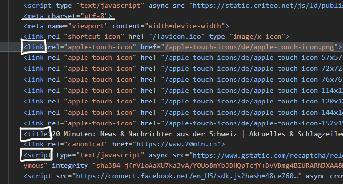

## Übung 1 - News-Seiten untersuchen
Wir finden, dass die Tageszeitungen (20 Minuten) die richtigen Tags verwenden. Die Skripte sind verlinkt und im Body sind die ```<div>``` vorhanden.

Innerhalb der Divs sind die einzelnen Attribute, w.z.B. Buttons, etc. vorhanden. 

Ausserdem haben sie separate CSS-Files erstellt, das sieht man an den Klassen der Tags.

Screenshot:
